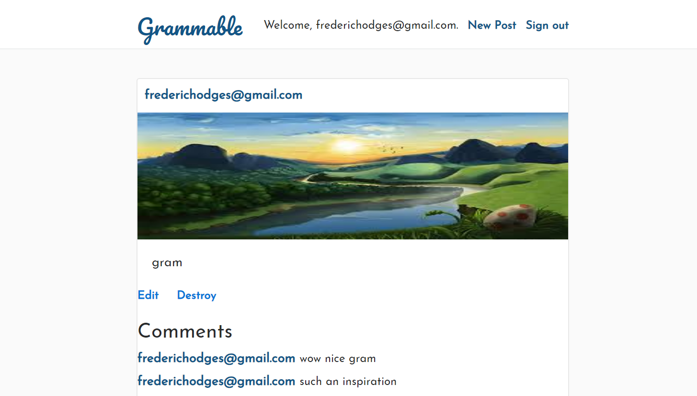

# Documentation

## Why this app exists:

This app was built for the purpose of gaining experience creating apps using a test-driven development approach. It emulates a popular social media website and shares much of the core functionality.

You may visit the deployed version [here](https://grammable-frederic-hodges.herokuapp.com/).

***
# Setup

## Prerequisites:
 
 The following tools should be installed on the system before following setup steps.
 
  - Git
  - Ruby 2.5.3
  - Rails 5.2.3
  
1. **Clone repo:**
       
        git@github.com:derfman9303/grammable.git
        
2. **On the command line, navigate to the grammable repository**
        
        cd grammable

3. **Create the database**
        
        rails db:create db:migrate
        
4. **Install gems**
        
        bundle install

***
# Usage

## Start your server:

        rails server -b 0.0.0.0 -p 3000

You may now visit your app at http://localhost:3030

## Running test suite:

This app uses the Rspec test suite, if you need to use it you may do so by editing the spec files in /grammable/spec and running the following command:

        bundle exec rspec

***
# Deployment

## Pushing to Heroku

If you would like, you may push your app up to Heroku by running the following commands:

        git init
        
        git add .
        
        git commit -am "initial commit"
        
        heroku create
        
        git push heroku master
